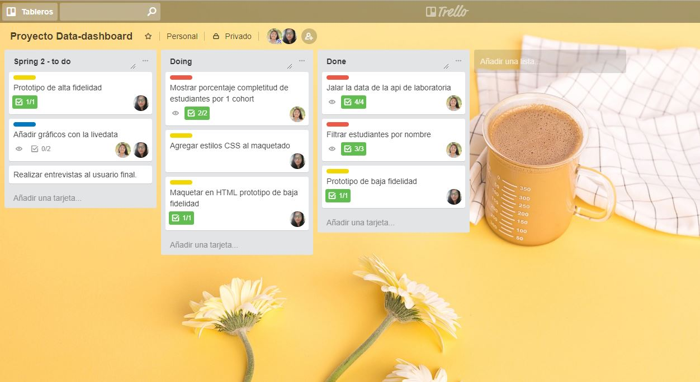
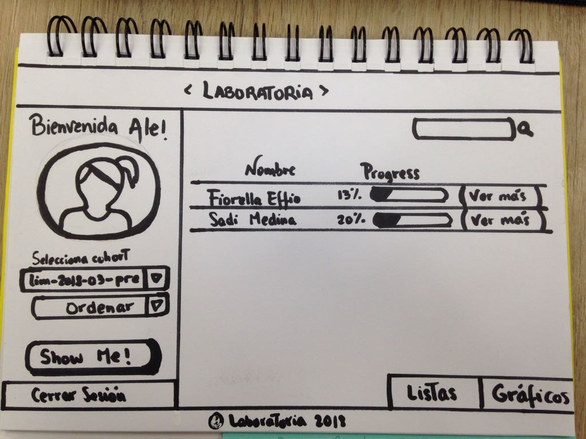
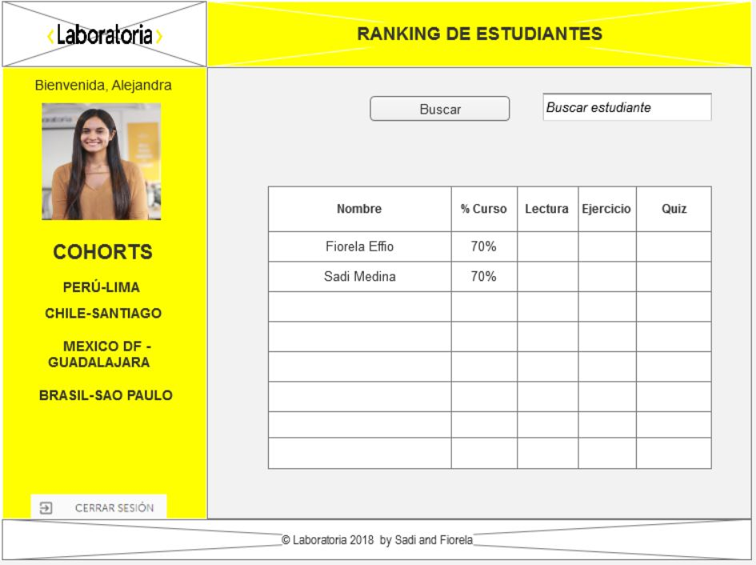

# Data Dashboard

## Introducción
Esta aplicación procesa información relevante acerca del progreso de las alumnas de Laboratoria para las Training Managers (TMs) con el fin de analizar de manera visual y tener un mejor entendimiento para poder apoyar a las alumnas en su aprendizaje, asimismo se puede ver estadisticas generales por cohort o tambien de manera individual por cada alumna.
Con esta aplicación se busca mejorar la manera en como las Training managers tienen acceso a la información, pasando del problema de manejar la data en bruto a poder comprender y tomar decisiones mas rápidas y complejas en base a datos mas simples y sencillos.
Finalmente estamos usando un _dashboard_ el cual se define como un espacio desde el cual un usuario puede tener acceso a la
información y controles más relevantes.

## Demo

Ingresa a la aplicación dando click aqui ->

### User Experience Design (¿Como lo pensamos?)

#### 1) Definición del producto
Para desarrollar el proyecto comenzamos dividiendo nuestro proyecto en miniproyectos con el fin de tener algo pequeño al inicio pero que funcione.
Usando trello podemos ver como dividimos nuestro proyecto.

Realizamos una entrevista a la Training Manager de Lima (Alejandra) y ademas tomamos en cuenta realizar entrevistas en cuanto a diseño a otros usuarios con el fin de tener una mejor vista del proyecto.

En base a las entrevistas realizadas desarrollamos nuestro primer prototipo de baja fidelidad con los minimos requerimientos del proyecto

Asimismo diseñamos en Axure RP 8 nuestro prototipo de alta fidelidad ya con todas las pautas que recibimos en las entrevistas

### 2) Implementación de la Interfaz de Usuario (HTML/CSS/JS) (¿Como lo implementamos?)

## Detalles de Implementación

### data.js
La idea de este archivo es contener toda la funcionalidad
que corresponda a obtener, procesar y manipular datos.

En este proyecto Controlador y Modelo estarán bajo
el archivo **data.js**.

El _boilerplate_ incluye tests que esperan que implementes las
siguientes 4 funciones y las _exportes_ al entorno global (`window`) dentro del
script `src/data.js`, ten en cuenta que esto es solo lo básico, si necesitas más
funciones puedes hacerlo:

#### 2) `sortUsers(users, orderBy, orderDirection)`

La función `sortUsers()` se encarga de _ordenar_ la lista de usuarios creada con
`computeUsersStats()` en base a `orderBy` y `orderDirection`.

##### Argumentos

* `users`: Arreglo de objetos creado con `computeUsersStats()`.
* `orderBy`: String que indica el criterio de ordenado. Debe permitir ordenar
  por nombre, porcentaje de completitud total, porcentaje de ejercicios
  autocorregidos completados, porcentaje de quizzes completados, puntuación
  promedio en quizzes completados, y porcentaje de lecturas completadas.
* `orderDirection`: La dirección en la que queremos ordenar. Posibles valores:
  `ASC` y `DESC` (ascendiente y descendiente).

##### Valor de retorno

Arreglo de usuarios ordenado.

#### 3) `filterUsers(users, search)`

##### Argumentos

* `users`: Arreglo de objetos creado con `computeUsersStats()`.
* `search`: String de búsqueda.

##### Valor de retorno

Nuevo arreglo de usuarios incluyendo solo aquellos que cumplan la condición de
filtrado, es decir, aquellos que contengan el string _search_ en el nombre
(`name`) del usuario.

#### 4) `processCohortData(options)`

Esta función es la que deberíamos usar al seleccionar un cohort y cada vez que
el usuario cambia los criterios de ordenado y filtrado en la interfaz. Esta
función debe invocar internamente a `computeUsersStats()`, `sortUsers()` y
`filterUsers()`.

##### Argumentos

* `options`: Un objeto con las siguientes propiedades:
  - `cohort`: Objeto cohort (de la lista de cohorts)
  - `cohortData`: Objeto con dos propiedades:
    + `users`: Arreglo de usuarios miembros del cohort.
    + `progress`: Objeto con data de progreso de cada usuario en el contexto de
      un cohort en particular.
  - `orderBy`: String con criterio de ordenado (ver `sortUsers`).
  - `orderDirection`: String con dirección de ordenado (ver `sortUsers`).
  - `search`: String de búsqueda (ver `filterUsers`)

##### Valor de retorno

Nuevo arreglo de usuarios _ordenado_ y _filtrado_ con la propiedad `stats`
añadida (ver `computeUsersStats`).

### main.js

Ten en cuenta también que existe otro archivo _main.js_ que no está solo por
casualidad en la estructura del proyecto. En general es una buena idea ir
separando la funcionalidad en varios archivos, ya que a medida que un proyecto
crece, se vuelve insostenible dejar todo en un solo archivo. En este caso puedes
usar _main.js_ para todo tu código que tenga que ver con mostrar los datos en la
pantalla, y _data.js_ para todas las funciones que vimos que obtienen y
manipulan los datos.

## Hacker edition

Features/características extra sugeridas:

* En lugar de consumir la data estática brindada en este repositorio, puedes
  consumir la data del [Live API de Laboratoria](https://api.laboratoria.la/).
  Lee la [documentación aquí](https://laboratoria.github.io/api.laboratoria.la/).
* Agregarle a tu interfaz de usuario implementada visualizaciones gráficas.
* Brindar el detalle de progreso de cada estudiante _por curso_
* Proveer estadísticas de progreso de todo el cohort

## Tips / Pistas

* [Array en MDN](https://developer.mozilla.org/es/docs/Web/JavaScript/Referencia/Objetos_globales/Array)
* [Array.sort en MDN](https://developer.mozilla.org/es/docs/Web/JavaScript/Referencia/Objetos_globales/Array/sort)
* [Array.map en MDN](https://developer.mozilla.org/es/docs/Web/JavaScript/Referencia/Objetos_globales/Array/map)
* [Array.filter en MDN](https://developer.mozilla.org/es/docs/Web/JavaScript/Referencia/Objetos_globales/Array/filter)
* [Array.reduce en MDN](https://developer.mozilla.org/es/docs/Web/JavaScript/Referencia/Objetos_globales/Array/reduce)
* [Array.forEach en MDN](https://developer.mozilla.org/es/docs/Web/JavaScript/Referencia/Objetos_globales/Array/forEach)
* [Object.keys en MDN](https://developer.mozilla.org/es/docs/Web/JavaScript/Referencia/Objetos_globales/Object/keys)
* [Object.entries en MDN](https://developer.mozilla.org/es/docs/Web/JavaScript/Referencia/Objetos_globales/Object/entries)
* [XMLHttpRequest en MDN](https://developer.mozilla.org/en-US/docs/Web/API/XMLHttpRequest)
* [Fetch API en MDN](https://developer.mozilla.org/en-US/docs/Web/API/Fetch_API)
* [json.org](https://json.org/json-es.html)
* [Postman](https://chrome.google.com/webstore/detail/postman/fhbjgbiflinjbdggehcddcbncdddomop?hl=en)
