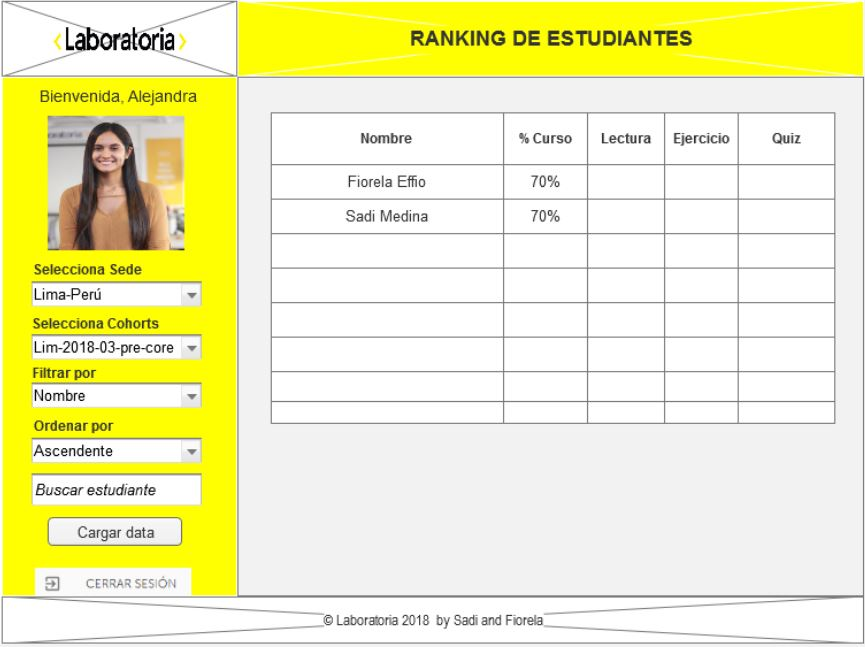

# Data Dashboard

## Introducción
Esta aplicación procesa información relevante acerca del progreso de las alumnas de Laboratoria para las Training Managers (TMs) con el fin de analizar de manera visual y tener un mejor entendimiento para poder apoyar a las alumnas en su aprendizaje, asimismo se puede ver estadisticas generales por cohort o tambien de manera individual por cada alumna.

Con esta aplicación se busca mejorar la manera en como las Training managers tienen acceso a la información, pasando del problema de manejar la data en bruto a poder comprender y tomar decisiones mas rápidas y complejas en base a datos mas simples y sencillos.
Finalmente estamos usando un _dashboard_ el cual se define como un espacio desde el cual un usuario puede tener acceso a la
información y controles más relevantes.

## Demo

Ingresa a la aplicación dando click aqui -> https://fiorellaeffio.github.io/lim-2018-05-bc-core-am-datadashboard/src/index.html
<!--  -->

### User Experience Design (¿Como lo pensamos?)

#### 1) Definición del producto
Para desarrollar el proyecto comenzamos dividiendo nuestro proyecto en miniproyectos con el fin de tener algo pequeño al inicio pero que funcione.

Usando trello podemos ver como dividimos nuestro proyecto.

Realizamos una entrevista a la Training Manager de Lima (Alejandra) y ademas tomamos en cuenta realizar entrevistas en cuanto a diseño a otros usuarios con el fin de tener una mejor vista del proyecto.

En base a las entrevistas realizadas desarrollamos nuestro primer prototipo de baja fidelidad con los minimos requerimientos del proyecto

Asimismo diseñamos en Axure RP 8 nuestro prototipo de alta fidelidad ya con todas las pautas que recibimos en las entrevistas

